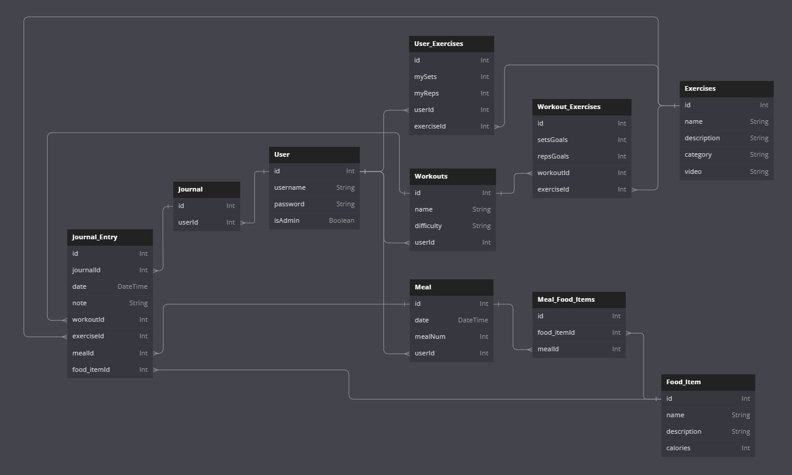
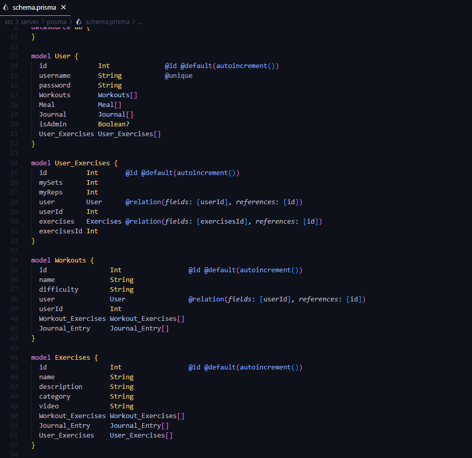
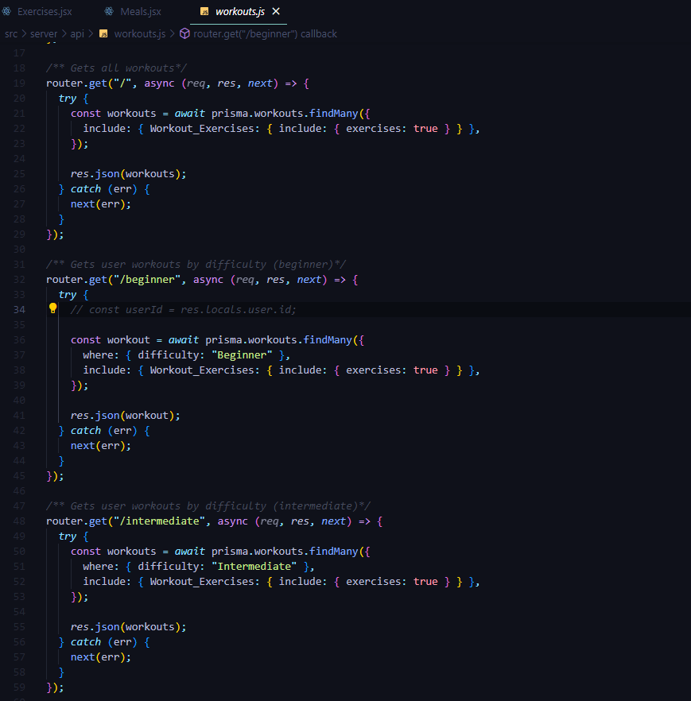
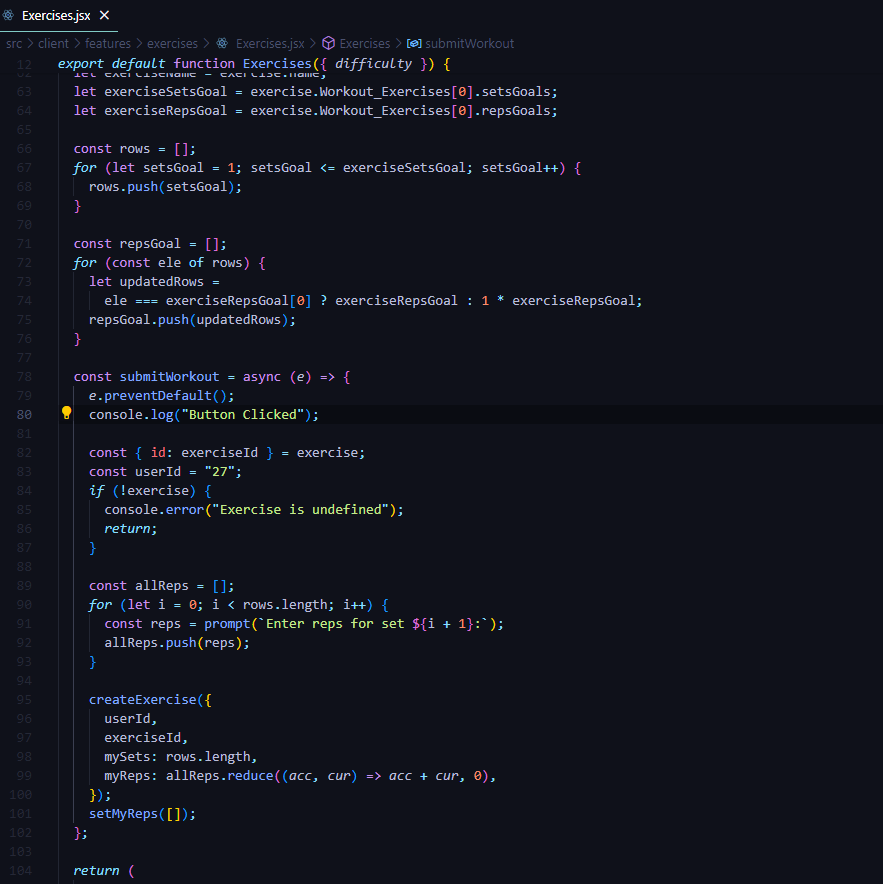
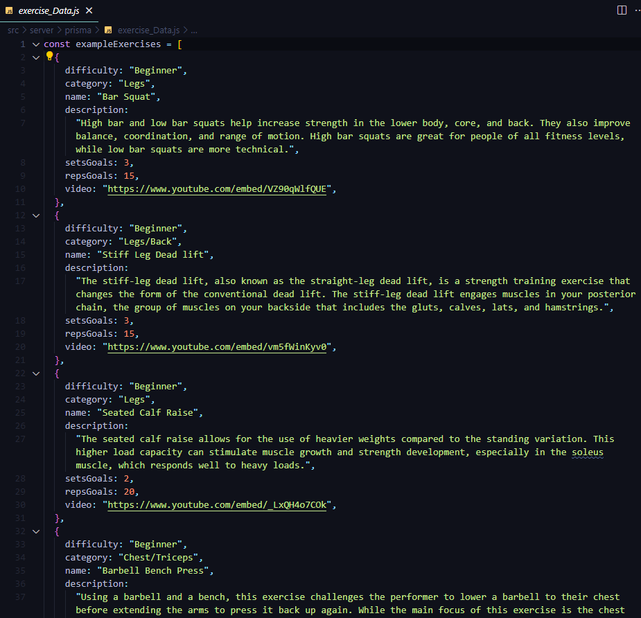
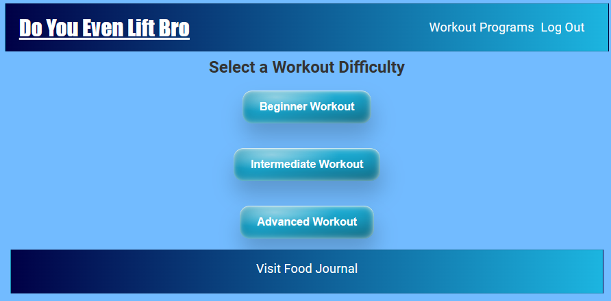
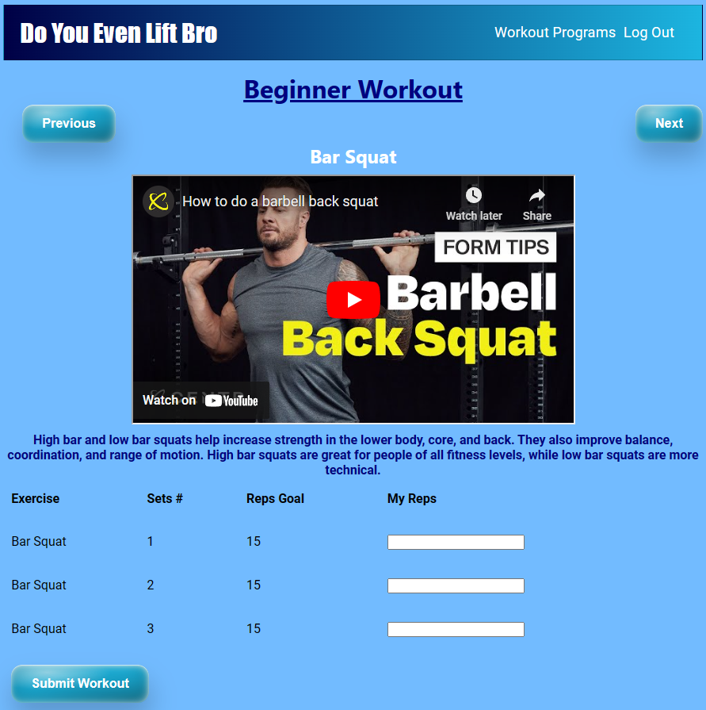
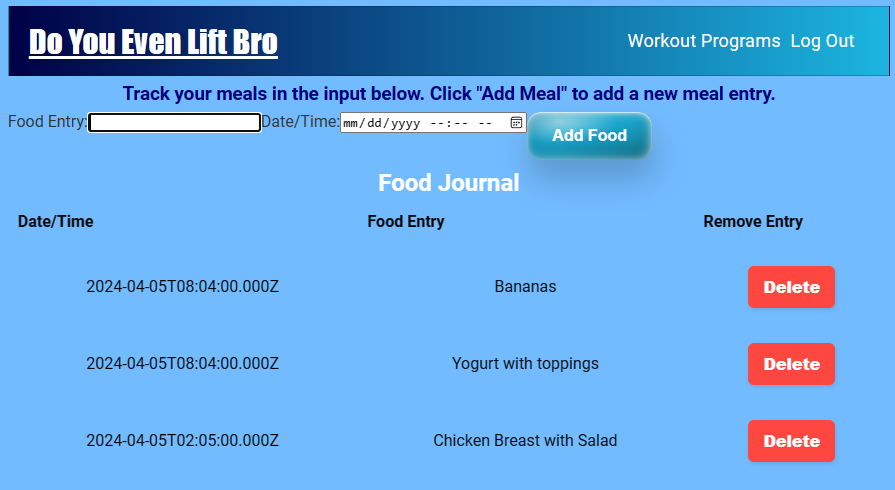

Do You Even Lift Bro!!!

- Fitness app

- This is app was created to keep track of food journal entries and recommended workout programs based on difficulty level
- A user registers and after logging in will be prompted to choose a workout based on the level of difficulty they would like to do

- Each difficulty has a name, description, video associated to the workout, recommended sets and reps, and prompt to enter the users reps per set
- The users entered reps will be stored and show on the bottom of the exercise pages for the user
- Only the users entered exercises data will show for the user

- The food journal has input fields for a food entry and timestamp
- Food journal entries will display for the user at the bottom of the page and give an option to delete an entry

Fitness App Schema Diagram

Schema Code

BackEnd code for Workouts

Programs page code

Exercises array code

Welcome Page

Programs Page

Workouts Page

Food Journal

